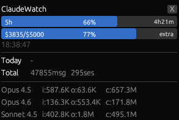

# ClaudeWatch

Claude Codeの使用状況とレートリミットをリアルタイム表示する常駐モニターツール。



## 表示内容

### Rate Limit
- **Session (5h)** - 5時間セッションリミットの使用率とリセットまでの残り時間
- **Weekly / Opus (7d) / Sonnet (7d)** - 該当するリミットがあれば表示
- **Extra Usage** - 従量課金の使用額と上限 (例: $3,835 / $5,000)

### Stats
- 今日のメッセージ数・セッション数・ツールコール数
- 累計メッセージ数・セッション数
- モデル別トークン使用量 (Input / Output / Cache)

## 仕組み

| データ | ソース | 更新間隔 |
|---|---|---|
| レートリミット | `GET /api/oauth/usage` (トークン消費なし) | 60秒 |
| 使用統計 | `~/.claude/stats-cache.json` (ローカルファイル) | 30秒 |

OAuth認証には `anthropic-beta: oauth-2025-04-20` ヘッダーが必要。トークン期限切れ時は `platform.claude.com` 経由で自動リフレッシュする。

## ビルド・実行

```
cargo run
```

## 必要環境

- Rust 1.85+
- Claude Code がインストール済みでログイン済み (`~/.claude/.credentials.json` が存在すること)

## ウィンドウ

- 常に最前面に表示 (always on top)
- サイズ: 400x420px
